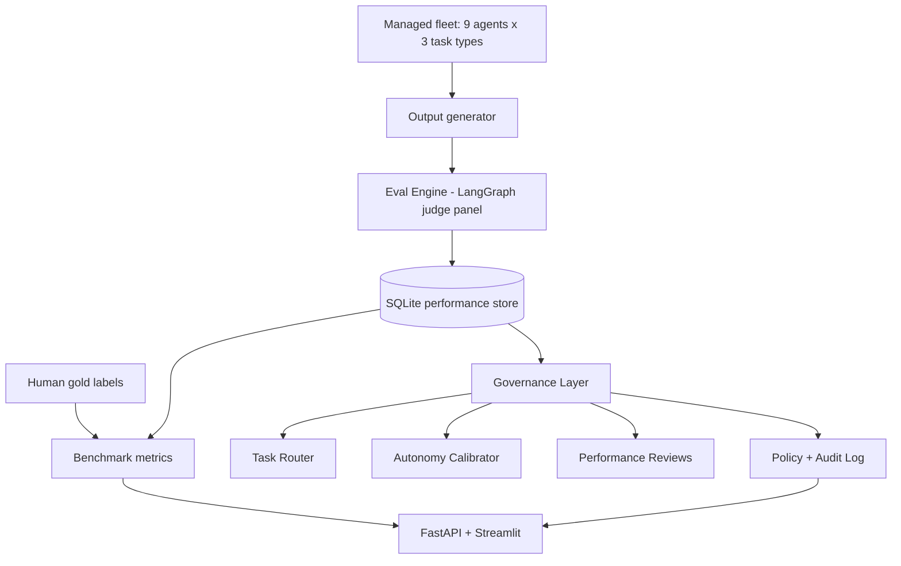

# Milestone 1 - Foundation & Working Platform

A chronological and structural record of everything done from repo creation
through the current state. This marks the first complete end-to-end build of the
Agent Workforce Governance platform (eval engine + governance layer + app +
tests + docs).

_Status as of this milestone: 14 commits, ~3,067 lines of Python, 40 passing
tests. Live benchmark KPIs pending an OpenAI key._

_Current extension: the fleet now includes translation, for 3 task types x 3
agent configs = 9 agents, with 43 passing tests._

---

## 1. Project origin and key decisions

**Assignment context:** Generative AI Systems Design & Implementation final
project - problem selection, market research, architecture, implementation
(50%), and pitch.

**Initial setup:**
- Local git repo initialized at `/home/gali/Documents/GR/FinalProjGR` on branch `main`
- Git identity set globally: **Gali Sandler** / `gali.sandler0@gmail.com`
- Assignment PDFs moved to `docs/` and committed

**Product direction (evolved in planning):**

| Decision | Choice | Rationale |
|---|---|---|
| Problem space | Agent **Workforce Governance**, not pure eval | Differentiator: answer operational questions eval platforms skip |
| Core engine | Multiagent **LLM-as-judge** eval harness | Rigorous scoring; validated against human gold labels |
| Orchestration | **LangGraph** | Explicit fan-out/join for judge panel |
| LLM provider | **OpenAI** (`gpt-4o` + `gpt-4o-mini`) | Strong judging; mini enables cost cascade |
| Stack | **Python** - FastAPI + Streamlit | Matches course methodology; fast to demo |
| Managed fleet | **3 task types x 3 agent configs = 9 agents** | Controllable gaps for routing/autonomy demos |
| Gold data | **Hybrid**: hand-labeled JSONL + optional SummEval/WMT public slices | Credibility + demo domain control |
| Team scope | **2 devs, ~10 days** (from plan) | Scoped fleet and features accordingly |

**Four governance questions** (product differentiator):
1. Which agent should get the next task?
2. How much autonomy should each agent have?
3. How is each agent performing over time?
4. How do we govern the fleet (policy + audit)?

---

## 2. Chronological timeline (14 commits)

| # | Commit | What was done |
|---|---|---|
| 1 | `dc3c682` | **Add assignment documents** - PDFs under `docs/` |
| 2 | `1946117` | **Add project plan and pitch** - `docs/plan.md`, `docs/pitch.md` (problem, Why Now, solution, 4 questions) |
| 3 | `3974390` | **Scaffold project structure** - `requirements.txt`, `.gitignore`, `.env.example`, `README.md`, package skeleton, `config.py`, data dirs |
| 4 | `37b15ea` | **Data models, LLM wrapper, performance store** - `schemas.py`, `llm.py`, `store.py` |
| 5 | `2e4cb36` | **Managed fleet** - 6 agents + output generator (`fleet/configs.py`, `fleet/generator.py`) |
| 6 | `c19ccaa` | **Baseline judge + runner** - single GPT-4o judge, judge-agnostic `runner.py` |
| 7 | `12aee08` | **Dataset loaders + gold set** - 16-item balanced RAG Q&A gold set, SummEval loader |
| 8 | `7441611` | **Multiagent judge panel** - 5 criterion judges + aggregator + LangGraph `PanelJudge` |
| 9 | `0e343ff` | **Metrics + benchmark** - kappa, Spearman, accuracy, cost/latency; `evaluation/benchmark.py` |
| 10 | `bfcf4d1` | **Governance layer** - profiles, router, autonomy, reviews, policy, audit log |
| 11 | `ec013af` | **Improvement levers** - `CascadeJudge` (cost), `JuryJudge` (quality) |
| 12 | `6a330b4` | **App layer** - FastAPI, Streamlit dashboard, `demo_seed.py` |
| 13 | `411b302` | **Project report** - `docs/report.md` (full assignment structure), README run instructions |
| 14 | `d27b44e` | **Pytest suite** - 40 offline tests, `pytest.ini`, `store.reset_db()` |

**Environment:** `.venv` created locally; dependencies installed from
`requirements.txt` (~3,067 lines of Python across `src/`, `app/`, `evaluation/`,
`tests/`).

---

## 3. Architecture built (two layers)



### Layer A - Eval engine

| Component | File(s) | Role |
|---|---|---|
| Config | `src/eval_harness/config.py` | Env-driven settings, project paths |
| Schemas | `src/eval_harness/schemas.py` | `TestItem`, `JudgeVerdict`, `AggregateResult`, `AgentProfile`, enums |
| LLM client | `src/eval_harness/llm.py` | OpenAI structured output, per-call cost/latency, `CostTracker` |
| Store | `src/eval_harness/store.py` | SQLite: `agents`, `evals`, `audit_log` |
| Baseline judge | `src/eval_harness/baseline.py` | Single GPT-4o call - bar to beat |
| Criterion judges | `src/eval_harness/agents/criteria.py` | 5 specialized judges |
| Aggregator | `src/eval_harness/agents/aggregator.py` | Weighted mean + safety gate |
| LangGraph panel | `src/eval_harness/graph.py` | `START -> 5 judges -> aggregate -> END` |
| Runner | `src/eval_harness/runner.py` | Batch eval, persist, run JSON reports |
| Metrics | `src/eval_harness/metrics.py` | Agreement vs human gold |
| Benchmark | `evaluation/benchmark.py` | CLI: compare baseline/panel/cascade/jury |
| Improvement | `src/eval_harness/improvement.py` | `CascadeJudge`, `JuryJudge` |

### Layer B - Governance layer

| Component | File | Role |
|---|---|---|
| Profiles | `governance/profiles.py` | Aggregate history -> pass rate, scores, trend, per-criterion |
| Autonomy | `governance/autonomy.py` | Pass rate + safety -> tier (`blocked` ... `full_auto`) |
| Router | `governance/router.py` | Score agents; pick best for next task |
| Reviews | `governance/reviews.py` | LLM or template performance review |
| Policy | `governance/policy.py` | Tier + task risk -> allow / approval / block |
| Audit | via `store.log_audit()` | Every governance decision logged |

### Layer C - Fleet, data, app

| Component | File(s) | Role |
|---|---|---|
| Fleet configs | `fleet/configs.py` | 9 agents with intentional quality gaps |
| Generator | `fleet/generator.py` | Produce candidate outputs for evaluation |
| Gold sets | `data/gold/*.jsonl` | RAG Q&A, summarization, and translation examples |
| Loaders | `datasets/loaders.py` | JSONL, gold, SummEval, WMT, hybrid |
| Demo seeder | `demo_seed.py` | Synthetic evals for offline demo |
| API | `app/api.py` | REST endpoints for all governance views |
| Dashboard | `app/ui.py` | 5-tab Streamlit UI |

---

## 4. Managed fleet (what gets evaluated)

**Task types:** `rag_qa`, `summarization`, `translation`

**Nine agents:**

| Agent ID | Task | Model | Variant | Expected behavior |
|---|---|---|---|---|
| `rag_strong` | RAG Q&A | gpt-4o | grounded prompt | Best quality |
| `rag_cheap` | RAG Q&A | gpt-4o-mini | grounded prompt | Cost/quality trade-off |
| `rag_weak` | RAG Q&A | gpt-4o-mini | ungrounded, high temp | Hallucinations |
| `sum_strong` | Summarization | gpt-4o | faithful prompt | Best quality |
| `sum_cheap` | Summarization | gpt-4o-mini | faithful prompt | Cheaper |
| `sum_weak` | Summarization | gpt-4o-mini | one-liner prompt | Drops key points |
| `trans_strong` | Translation | gpt-4o | professional prompt | Best quality |
| `trans_cheap` | Translation | gpt-4o-mini | professional prompt | Cost/quality trade-off |
| `trans_weak` | Translation | gpt-4o-mini | literal prompt | Unfaithful/disfluent translations |

---

## 5. Judge configurations (4 modes)

| Mode | `judge_mode` | Description |
|---|---|---|
| Baseline | `baseline` | 1x GPT-4o, simple prompt |
| Panel | `panel` | 5 criterion judges -> weighted aggregator |
| Cascade | `cascade` | gpt-4o-mini first; escalate borderline to gpt-4o |
| Jury | `jury` | 3x panel runs; median per criterion |

**Aggregator weights:** correctness 35%, faithfulness 30%, completeness 20%,
coherence 15%; safety is a hard gate (not weighted).

**Success targets (from plan/report):**
- Pass/fail accuracy >= 80%
- Cohen's kappa >= 0.6
- Spearman >= 0.7 on scores

---

## 6. Documentation produced

| Document | Purpose |
|---|---|
| `docs/Final Assignment ...pdf` | Course assignment spec |
| `docs/Project Breakdown.pdf` | POC methodology slides |
| `docs/plan.md` | Build plan, architecture, 10-day split, repo structure |
| `docs/pitch.md` | Hand-in pitch: problem, Why Now, solution, 4 questions |
| `docs/report.md` | Full assignment write-up (sections 1-5); KPI table placeholders |
| `README.md` | Overview, stack, layout, setup, run commands |

---

## 7. Testing

**43 pytest tests**, all offline (fake LLM client, temp SQLite DB):

| Test file | Coverage |
|---|---|
| `test_schemas.py` | Pydantic models |
| `test_store.py` | CRUD, upsert, audit |
| `test_aggregator.py` | Weighting, safety gate, low-quality fail |
| `test_metrics.py` | Perfect/partial agreement, edge cases |
| `test_fleet.py` | 9 agents, prompt rendering |
| `test_loaders.py` | Gold sets, summarization/translation labels, JSONL roundtrip |
| `test_runner.py` | Persistence, error capture |
| `test_autonomy.py` | All tier thresholds |
| `test_governance.py` | End-to-end via demo seeder |
| `test_judges.py` | Baseline, panel, cascade, jury with fake client |

Run: `pytest` (from project root with `.venv` active).

---

## 8. Verification performed (without API key)

| Check | Result |
|---|---|
| Store round-trip | Agent upsert, eval record, audit log |
| LangGraph panel compile | 5 verdicts -> aggregate |
| Governance smoke test | `rag_weak` blocked; router picks strong/cheap |
| FastAPI endpoints | All routes return expected data after seed |
| Streamlit launch | HTTP 200 on port 8765 |
| pytest | 43 passed |

---

## 9. What is not done yet

| Item | Status | Notes |
|---|---|---|
| Real benchmark KPIs | **Pending** | Needs `OPENAI_API_KEY` in `.env`; ~$1 for gold-set `--with-improve` |
| Gold set expansion | **Done for POC** | Local gold coverage exists for RAG Q&A, summarization, and translation |
| Public slices | **Optional** | SummEval via `--public`; WMT via `--wmt`; cached only after first run |
| GitHub remote | **Done** | Repository link added to `docs/report.md` |
| Slide deck | **Not built** | Pitch text exists; no presentation slides |
| `calibration.py` | **Not implemented** | Mentioned in README/plan; bias mitigation not coded |
| Fleet output generation (live) | **Not run** | Generator ready; needs API key |
| Plan todo statuses in `plan.md` | **Done** | Frontmatter now reflects completed build work |

---

## 10. How to run what exists today

```bash
# Setup (once)
python -m venv .venv && source .venv/bin/activate
pip install -r requirements.txt
cp .env.example .env   # add OPENAI_API_KEY for live runs

# Offline
pytest
PYTHONPATH=src streamlit run app/ui.py   # click "Seed demo data"

# Live (fill KPI table)
PYTHONPATH=src python -m evaluation.benchmark --mode compare --with-improve
PYTHONPATH=src python -m evaluation.benchmark --mode compare --wmt --wmt-limit 40

# API
PYTHONPATH=src uvicorn app.api:app --reload
```

---

## 11. Suggested next steps (priority order)

1. Run real benchmark -> fill KPI table in `docs/report.md`
2. Commit and push the latest translation/summarization additions
3. Build 6-8 slide deck from `docs/pitch.md` + architecture diagram
4. Record demo video backup for class presentation
5. Optional: add GitHub Actions CI for the offline test suite
