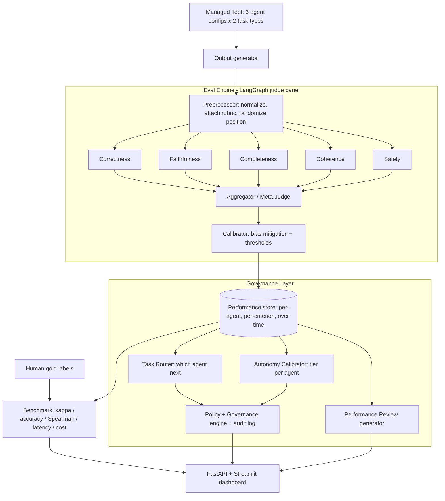

# Agent Workforce Governance Platform

## Concept
Most tools stop at *scoring* model outputs. This platform manages a **fleet of AI agents like a team**: a multiagent LLM-as-judge **eval engine** continuously scores agents, and a **governance layer** turns that history into four decisions:

1. Which agent should get the next task? (performance-aware routing)
2. How much autonomy should each agent have? (reliability -> autonomy tier)
3. Agent performance reviews (longitudinal per-agent scorecards)
4. Organizational governance (policy enforcement, escalation, audit trail)

The eval engine's own quality is validated by **agreement with human gold labels** (accuracy, Cohen's kappa, Spearman) - the headline success metric that keeps the project rigorous.

- Stack: Python, LangGraph, OpenAI (`gpt-4o` + `gpt-4o-mini`), Pydantic, SQLite (SQLModel) for the performance store, pandas/scipy/scikit-learn (metrics), FastAPI (API), Streamlit (dashboard).
- Data: Hybrid - a public human-labeled eval slice (e.g. MT-Bench judgments or SummEval) + a custom ~30-50 item hand-labeled gold set in the demo domain.

## Managed Fleet (the thing being governed)
- 2 task types: **RAG/Q&A** and **summarization** (both have public gold data and are easy to grade).
- 3 competing agent configs per task type = **6 logical agents**: `gpt-4o`, `gpt-4o-mini`, and a deliberately weaker prompt/temperature variant.
- Deliberate performance gaps make routing, reviews, and autonomy tiers show clear, demo-able differences.

## POC Scope (assignment "Scoping Your POC" section)
- Input: `(task, agent_id, candidate_output, optional reference/context, rubric)` records.
- Output (eval): per-criterion scores (1-5) + pass/fail + aggregate + rationale with quoted evidence.
- Output (governance): a routing decision, an autonomy tier, and a per-agent review derived from accumulated scores.
- Success metric: agreement of harness verdicts with human gold labels.
- Target: >= 80% pass/fail agreement and Cohen's kappa >= 0.6 (Spearman >= 0.7 on scores) before adding complexity.
- Minimum viable test set: custom gold set (~30-50 items) + public slice (~50-100 items).
- Baseline first: single GPT-4o judge + simple prompt, then add the multiagent panel and governance.

## Architecture

## Governance Layer detail
- Router: score each agent for an incoming task (task-type competence, reliability, cost, latency); pick the best, with a tie-break/explore option.
- Autonomy calibrator: map reliability + error/variance + safety flags to tiers - full auto / auto + spot-check / human-in-the-loop / blocked - with explicit thresholds.
- Performance reviews: aggregate the store into per-agent scorecards (strengths/weaknesses by criterion & task-type, trend, regressions), rendered as an LLM-written review.
- Policy/governance engine: rules that gate actions (low-autonomy agents need approval, safety-critical tasks require human review) + an audit log of every decision.

## Improvement Dimension (assignment requires improving at least one)
- Quality lever: jury/debate pass + rubric decomposition + bias mitigation (position & verbosity) -> higher agreement vs single-judge baseline.
- Cost lever: model cascade - `gpt-4o-mini` screens every item, escalate only borderline items to `gpt-4o`; report cost/latency vs all-`gpt-4o`.

## Proposed Repo Structure
- `src/eval_harness/schemas.py` - Pydantic models (`TestItem`, `JudgeVerdict`, `AggregateResult`, `AgentProfile`, `AutonomyTier`, `Policy`).
- `src/eval_harness/llm.py` - OpenAI wrapper, model selection, token/cost tracking.
- `src/eval_harness/store.py` - SQLite (SQLModel) registry + per-run results.
- `src/eval_harness/fleet/` - agent configs + output generator for the managed fleet.
- `src/eval_harness/graph.py` - `build_graph()` LangGraph judge panel.
- `src/eval_harness/agents/` - `correctness.py`, `faithfulness.py`, `completeness.py`, `coherence.py`, `safety.py`, `aggregator.py`, `jury.py`.
- `src/eval_harness/calibration.py` - bias mitigation + thresholds.
- `src/eval_harness/metrics.py` - kappa / Spearman / accuracy vs gold.
- `src/eval_harness/datasets/loaders.py` - public + custom gold-set loaders.
- `src/eval_harness/governance/` - `router.py`, `autonomy.py`, `reviews.py`, `policy.py`.
- `src/eval_harness/runner.py` - run engine over a set, persist to store + `data/runs/`.
- `evaluation/benchmark.py` - agreement metrics + report.
- `app/api.py` (FastAPI) and `app/ui.py` (Streamlit dashboard).
- `data/public/`, `data/gold/`, `data/runs/`; plus `requirements.txt`, `.env.example`, `.gitignore`, `README.md`.

## 10-Day Plan for 2 Developers
- Dev A (eval engine): scaffold, schemas+store, fleet generator, baseline judge, multiagent panel, metrics/benchmark, improvement lever.
- Dev B (governance + product): dataset/gold set, router, autonomy calibrator, review generator, policy/audit engine, FastAPI + Streamlit dashboard.
- Shared: write-ups, demo, pitch.
- Days 1-2: scaffold, schemas, store, fleet + gold set. Days 3-4: baseline + multiagent panel + metrics (hit target). Days 5-6: governance layer (router/autonomy/reviews/policy). Days 7-8: dashboard + improvement lever + scale test. Days 9-10: write-ups, KPIs, demo video, pitch rehearsal.

## Deliverables mapped to the rubric
- Problem + market gap (vs pure eval platforms) + architecture write-ups (sections 1-3) in `docs/`.
- Working platform + baseline-vs-improved comparison (section 4 / 50%).
- Technical KPIs (agreement, latency, cost) + business framing (governance/decision automation, eval hours saved) for the pitch (sections 4-5).
