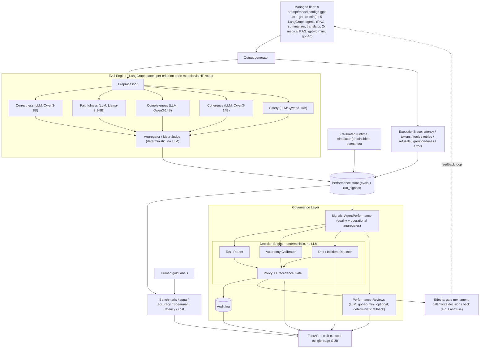

# Agent Workforce Governance - Project Report

This report follows the assignment structure (problem, market research,
architecture, implementation, pitch). The pitch narrative is in
[pitch.md](pitch.md); the build plan is in [plan.md](plan.md).

---

## 1. Problem Selection & Definition

**Chosen business problem.** Teams increasingly run *fleets* of AI agents
(different models, prompts, and tools) across many tasks, but they manage that
fleet blind. Existing evaluation tools produce a quality *score* and stop there;
they do not answer the operational questions a manager faces daily: which agent
should take the next task, how much autonomy each agent should have, whether an
agent is silently regressing, and how to enforce oversight and keep an audit
trail.

- **Industry / Domain:** AI/ML platform & operations (AgentOps / LLMOps).
- **Current processes:** Ad-hoc spreadsheets, one-off eval scripts, and gut feel
  to decide which model/agent to use; autonomy granted by assumption, not evidence.
- **Pain points:** Wrong agent on the wrong task; over- or under-granted autonomy;
  undetected regressions after model swaps; no accountable record for compliance.
- **Business impact:** Wasted spend on overpowered models, quality incidents,
  and compliance exposure as automated decisions scale.

## 2. Market Research & Technical Discovery

**Market landscape.** The capabilities this platform needs already exist in the
market - but fragmented across four separate product categories, none of which
closes the loop from *measured quality* into *governed action*:

| Category | Representative tools (2026) | What they do | What they leave open |
| --- | --- | --- | --- |
| Eval / observability | LangSmith, Langfuse, Arize Phoenix, Ragas, OpenAI Evals | Score quality, trace runs, replay against new model versions, 50+ eval metrics | Stop at dashboards - no routing, autonomy, or policy action |
| LLM routers / gateways | OpenRouter, Portkey, LiteLLM, ClawRouters, Bifrost | Route requests across models by cost / latency / capability | Route on model price-capability, not measured per-agent, per-task competence |
| AI governance / control | ServiceNow AI Control Tower, Salesforce Einstein Trust Layer | Policy enforcement, PII masking, audit trails for agent actions | Compliance-centric; autonomy not earned from a validated quality signal |
| Agent workforce mgmt (emerging) | agnt8x, Salesforce Agentforce, Google Agent Inbox | "Manage agents like a team," orchestration, single audit trail | Orchestration / identity centric; no validated competence-based routing or earned autonomy |

- **Market gap.** The honest gap is not that these capabilities are absent - by
  2026 each pillar (routing, autonomy, reviews, policy) exists as a point
  solution, and an "agent workforce management" category is actively forming. The
  gap is that **no platform connects them around a validated competence signal**.
  Routers route on price; eval tools measure and stop; governance suites enforce
  policy. Our wedge is the integration: per-agent, per-task-type competence from a
  judge we have *proven* trustworthy (agreement with human gold labels, Cohen's
  kappa >= 0.6) drives both *who gets the task* and *how much autonomy* - with an
  audit trail - as one accountable system rather than four disconnected ones.
- **Why now.** Gartner forecasts ~40% of enterprise applications will embed
  task-specific agents by end of 2026 (up from <5% in 2025), while McKinsey
  reports only ~1 in 3 enterprises are governance-ready for autonomous agents. The
  pain is real and the category is still forming - the right moment to build the
  integration layer.
- **Target audience.** Teams operating multiple agents in production who must
  control cost, reliability, and governance (platform/ML-ops engineers, eng
  managers, risk/compliance).

**Technical discovery.**

- **Data availability:** Public human-labeled eval data (SummEval for
  summarization, WMT for translation) for credibility, plus small hand-labeled
  gold sets we control for the demo domain.
- **Feasibility:** LLM-as-judge is well established; the novel work is the
  governance layer and validating the judge against human labels.
- **Key risk:** Judge reliability. Mitigated by measuring agreement with humans
  and only trusting the judge once it clears a target (kappa >= 0.6).

## 3. Proposed GenAI System Architecture

**Solution concept.** A multiagent **LLM-as-judge** eval engine scores every
agent in the fleet across five criteria, while each agent execution also emits
**operational telemetry** (latency, tokens, tool calls, retries, refusals,
groundedness, errors, safety flags). Both streams are written to a performance
store, and a **governance layer** reads that history to make four decisions:
routing, autonomy calibration, performance reviews, and policy enforcement -
now informed by both quality *and* operational reliability.

**Key functionalities.**

- Multiagent judge panel (correctness, faithfulness, completeness, coherence,
  safety) with a deterministic aggregator and a safety gate.
- Judge validated against human gold labels (accuracy, Cohen's kappa, Spearman).
- Real **LangGraph runtime agents** (RAG retrieve-check-retry, summarizer
  draft-verify-refine, translator translate-backcheck-retry, and two clinical
  medical-RAG variants - a strict `med_rag_weak` and a higher-capability
  `med_rag_strong`) that emit genuine execution traces, alongside the prompt/model
  fleet configs. The registry holds **14 agents** (9 prompt/model configs + 5
  LangGraph); each is governed independently by `agent_id`.
- **Operational signal capture** per execution (`ExecutionTrace` -> `run_signals`
  store): uptime, error rate, p95 latency, tool success rate, retries, refusals,
  groundedness, token usage, and safety flags.
- A **calibrated runtime simulator** that scales telemetry across a time window
  with injectable drift/incident scenarios, so governance dynamics are visible
  without large real spend.
- Governance: performance-aware router, autonomy tiers, automated reviews, a
  policy engine with an audit log, and **drift/incident alerting** over the
  operational signals.

Within the governance layer, the deterministic **decision engine** - task
router, autonomy calibrator, drift/incident detector, and a policy/precedence
gate - converts the stored **signals** (aggregated quality + operational
performance) into decisions. The signals are its *inputs*; performance reviews,
the audit log, and the write-back/gating **effects** are its *outputs*. In other
words, "governance layer" is the umbrella capability, and the "decision engine"
is its deterministic core (the part that actually decides).

LLM-backed blocks show their model in parentheses; unlabeled blocks are
deterministic (no LLM call).



**Technology stack.**

| Component | Technology choice | Reason |
| --- | --- | --- |
| Orchestration | LangGraph | Fan-out/join graph for the judge panel; also powers the real runtime agents (retrieve/verify/retry loops) |
| Judge LLMs | Per-criterion open models via the HF Inference Providers router (Qwen3-8B / Llama-3.1-8B / Qwen3-14B, see `config/judge_panel.json`); OpenAI `gpt-4o` + `gpt-4o-mini` for forced single-model / cascade modes | Each criterion judged by the model that won it in the `hf_judges` benchmark; `gpt-4o-mini` enables a cost cascade |
| Data models | Pydantic | Structured LLM outputs and typed DTOs, incl. `ExecutionTrace` telemetry |
| Performance store | SQLite via SQLModel | Zero-setup system of record: `evals` (quality) + `run_signals` (operations) + audit |
| Metrics | pandas, scipy, scikit-learn | Kappa, Spearman, precision/recall |
| API | FastAPI | Lightweight service surface; also serves the web console |
| Console (GUI) | Static single-page app (HTML/CSS/JS) served by FastAPI | Zero build step, same-origin, demo-friendly UI |

## 4. Implementation

**Scoping the POC.**

- **Input:** `(task, agent_id, candidate_output, optional context/reference, rubric)`.
- **Output (eval):** per-criterion scores (1-5), pass/fail, aggregate, rationale.
- **Output (operations):** per-execution `ExecutionTrace` (latency, tokens, tool
  calls/failures, retries, refusals, groundedness, errors, safety flags).
- **Output (governance):** routing decision, autonomy tier, performance review,
  and drift/incident alerts.
- **Success metric:** agreement of the judge's verdicts with human gold labels.
- **Target:** >= 80% pass/fail accuracy and Cohen's kappa >= 0.6 (Spearman >= 0.7).
- **Minimum viable test set:** hand-labeled RAG, summarization, and translation
  gold sets, plus optional public SummEval and WMT slices.

**Development steps.**

1. **Data preparation** - hand-labeled gold sets in `data/gold/`, plus cached
   SummEval and WMT loaders ([loaders.py](../src/eval_harness/datasets/loaders.py)).
2. **Model integration** - OpenAI wrapper with structured output and per-call
   cost/latency tracking ([llm.py](../src/eval_harness/llm.py)).
3. **Application logic** - LangGraph judge panel + aggregator
   ([graph.py](../src/eval_harness/graph.py)), and the governance layer
   ([governance/](../src/eval_harness/governance)).
4. **Real runtime agents** - LangGraph agents that emit execution traces
   ([agents/](../agents)), wired through a pluggable registry
   ([registry.py](../src/eval_harness/fleet/registry.py)) and shared trace
   helpers ([traced_agent.py](../src/eval_harness/fleet/traced_agent.py)).
5. **Operational telemetry** - `ExecutionTrace` schema and a `run_signals` store
   ([schemas.py](../src/eval_harness/schemas.py),
   [store.py](../src/eval_harness/store.py)); the fleet runner persists a signal
   per execution, including failures ([fleet_run.py](../evaluation/fleet_run.py)).
6. **Calibrated simulator** - scales telemetry across a time window with
   injectable drift/incident scenarios
   ([simulate_runtime.py](../src/eval_harness/simulate_runtime.py)).
7. **Operational governance** - profiles, router, and autonomy extended with
   operational signals, plus a drift/alert module
   ([profiles.py](../src/eval_harness/governance/profiles.py),
   [drift.py](../src/eval_harness/governance/drift.py)).
8. **Testing & validation** - benchmark vs gold labels
   ([benchmark.py](../evaluation/benchmark.py)); baseline vs panel vs cascade/jury;
   plus offline tests for telemetry, the simulator, runtime agents, and
   operational governance.

**Improvement levers** ([improvement.py](../src/eval_harness/improvement.py)).

- **Cost:** `CascadeJudge` screens with `gpt-4o-mini` and escalates only
  borderline items to `gpt-4o` - cutting cost on clear-cut items.
- **Quality:** `JuryJudge` takes the median of repeated panel runs to reduce
  variance and single-run bias.

**Technical KPIs - configuration comparison (76-item gold set, 2026-06-04).** The
`Panel` column here was measured on the earlier single-model **gpt-4o** panel and
is kept as the methodology baseline; the *current* default panel routes each
criterion to an HF-router open model (`config/judge_panel.json`) and is reported
separately below.

| Metric | Target | Baseline | Panel (gpt-4o) | Cascade | Jury |
| --- | --- | --- | --- | --- | --- |
| Pass/fail accuracy vs human | >= 80% | 100% | 98.7% | 100% | 98.7% |
| Cohen's kappa | >= 0.6 | 1.00 | 0.97 | 1.00 | 0.97 |
| Spearman (score vs human) | >= 0.7 | 0.98 | 0.98 | 0.95 | 0.97 |
| Score MAE vs human (1-5) | lower is better | 0.24 | 0.26 | 0.32 | 0.27 |
| Avg latency / item | < 2 s (baseline) | 1.6 s | 10.6 s | 9.7 s | 35.7 s |
| Cost / item | lower is better | $0.0013 | $0.0080 | $0.0010 | $0.0240 |

All four configurations exceed the assignment targets on agreement metrics.
The panel adds per-criterion breakdowns for governance decisions. The cascade is
the best cost lever: it preserves perfect pass/fail agreement while costing less
per item than the baseline. The jury is the quality/redundancy lever, but it is
much slower and more expensive.

**Current judge panel (HF open models).** The shipped panel assigns each criterion
to the open model that won it in the `hf_judges` benchmark (latest run 2026-06-11,
same 76-item gold set). Per-criterion agreement vs human gold:

| Criterion | Judge model | Pass-acc | Kappa | Spearman | MAE |
| --- | --- | --- | --- | --- | --- |
| Correctness | Qwen3-8B | 0.974 | 0.947 | 0.951 | 0.237 |
| Faithfulness | Llama-3.1-8B | 0.974 | 0.947 | 0.950 | 0.342 |
| Completeness | Qwen3-14B | 1.000 | 1.000 | 0.965 | 0.276 |
| Coherence | Qwen3-14B | 1.000 | 1.000 | 0.973 | 0.184 |
| Safety | Qwen3-14B | 0.934 | 0.868 | 0.956 | 0.237 |

Each constituent open model, run as a full single-model panel, scores overall
**pass-accuracy 0.97-1.00 / kappa 0.95-1.00 / Spearman 0.94-0.96** - the same
agreement band as the gpt-4o panel above - while the mixed panel costs
**~$0.00014 / item (~57x cheaper than gpt-4o's $0.0080)**, with per-criterion
latencies of ~1.1-1.4 s (≈6.2 s summed across the five judges). In short: swapping
the gpt-4o panel for the per-criterion open-model panel **holds judge quality and
cuts cost by ~98%**.
(The combined item-level pass-accuracy/kappa of the mixed panel - one cell per the
table above - can be regenerated with `evaluation.benchmark --mode compare`.)

**Operational KPIs (from `run_signals`).** Beyond judge quality, the platform now
tracks fleet *operations*, surfaced in the KPI report
([kpi_report.py](../evaluation/kpi_report.py)) and the dashboard's Operations tab:

| Metric | Target | Source |
| --- | --- | --- |
| Uptime (successful executions / total) | >= 99% | `run_signals.success` |
| Error rate (failed executions / total) | < 5% | `run_signals.success` |
| P95 latency (agent execution) | < 2 s | `run_signals.latency_s` |
| Tool success rate | >= 90% | `run_signals.tool_calls` vs `tool_failures` |
| Operational drift (recent vs older error rate) | ~0 (stable) | time-windowed `run_signals` |

These signals feed governance directly: the router penalizes high error rate and
p95 latency (and gates on tool success), the autonomy calibrator blocks agents
with high operational error or safety flags and demotes agents showing drift, and
the drift module raises alerts for error-rate spikes, sustained high error rate,
groundedness drops, and safety incidents.

**Challenges & solutions.**

- *Trusting the judge:* solved by benchmarking against human gold labels before
  using its scores for governance.
- *LLM-judge cost:* solved with the cheap-first cascade.
- *Reproducibility:* deterministic aggregation (no extra LLM call) so the overall
  verdict is stable and cheap.

## 5. Pitch

See [pitch.md](pitch.md). Demo flow: seed/benchmark or simulate runtime -> show
fleet leaderboard -> Operations tab (uptime, error rate, p95, tool success,
drift alerts) -> autonomy tiers -> route a RAG, summarization, or translation
task -> generate a performance review -> policy check + audit log.

## Code repository

Full code repository: [GaliDev/potential-train](https://github.com/GaliDev/potential-train)

## How to run

```bash
python -m venv .venv && source .venv/bin/activate
pip install -r requirements.txt
cp .env.example .env   # add HF_TOKEN (default per-criterion panel) +
                       # OPENAI_API_KEY (forced single-model / cascade / jury)

# Benchmark the judge vs gold labels (HF_TOKEN for the panel; OPENAI_API_KEY for
# baseline/cascade/jury modes)
PYTHONPATH=src python -m evaluation.benchmark --mode compare --with-improve

# Optional: include public translation labels from WMT
PYTHONPATH=src python -m evaluation.benchmark --mode compare --wmt --wmt-limit 40

# Generate timestamped operational history with drift/incident scenarios (offline)
PYTHONPATH=src python -m eval_harness.simulate_runtime

# Run the real LangGraph runtime agents over gold tasks (needs API key)
PYTHONPATH=src python -m evaluation.fleet_run --limit-per-type 1

# Render the Technical + Business + operational KPI report
PYTHONPATH=src python -m evaluation.kpi_report

# Launch the GUI + API (FastAPI serves the web console at http://localhost:8000;
# works offline via the "⋯" menu → "Seed data" / "Simulate runtime")
PYTHONPATH=src uvicorn app.api:app --reload
```
