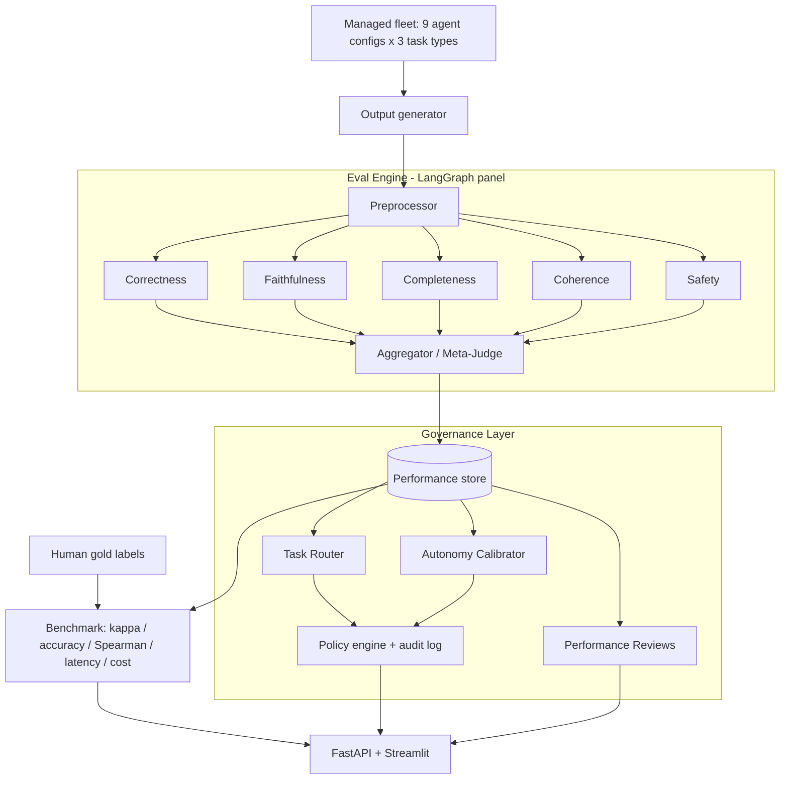

# Agent Workforce Governance - Project Report

This report follows the assignment structure (problem, market research,
architecture, implementation, pitch). The pitch narrative is in
[pitch.md](pitch.md); the build plan is in [plan.md](plan.md).

---

## 1. Problem Selection & Definition

**Chosen business problem.** Teams increasingly run *fleets* of AI agents
(different models, prompts, and tools) across many tasks, but they manage that
fleet blind. Existing evaluation tools produce a quality *score* and stop there;
they do not answer the operational questions a manager faces daily: which agent
should take the next task, how much autonomy each agent should have, whether an
agent is silently regressing, and how to enforce oversight and keep an audit
trail.

- **Industry / Domain:** AI/ML platform & operations (AgentOps / LLMOps).
- **Current processes:** Ad-hoc spreadsheets, one-off eval scripts, and gut feel
  to decide which model/agent to use; autonomy granted by assumption, not evidence.
- **Pain points:** Wrong agent on the wrong task; over- or under-granted autonomy;
  undetected regressions after model swaps; no accountable record for compliance.
- **Business impact:** Wasted spend on overpowered models, quality incidents,
  and compliance exposure as automated decisions scale.

## 2. Market Research & Technical Discovery

**Market landscape.** Existing solutions cluster into eval/observability tools
(e.g. LangSmith, Langfuse, Ragas, OpenAI Evals, Arize Phoenix). They are strong
at *measuring* quality - scores, traces, dashboards.

- **Market gap:** None of them own the *decision layer* that converts measured
  quality into operational actions - task routing, autonomy tiers, performance
  reviews, and policy enforcement across a fleet over time.
- **Target audience:** Teams operating multiple agents in production who must
  control cost, reliability, and governance (platform/ML-ops engineers, eng
  managers, risk/compliance).

**Technical discovery.**

- **Data availability:** Public human-labeled eval data (SummEval for
  summarization, WMT for translation) for credibility, plus small hand-labeled
  gold sets we control for the demo domain.
- **Feasibility:** LLM-as-judge is well established; the novel work is the
  governance layer and validating the judge against human labels.
- **Key risk:** Judge reliability. Mitigated by measuring agreement with humans
  and only trusting the judge once it clears a target (kappa >= 0.6).

## 3. Proposed GenAI System Architecture

**Solution concept.** A multiagent **LLM-as-judge** eval engine scores every
agent in the fleet across five criteria and writes results to a performance
store. A **governance layer** reads that history to make four decisions:
routing, autonomy calibration, performance reviews, and policy enforcement.

**Key functionalities.**

- Multiagent judge panel (correctness, faithfulness, completeness, coherence,
  safety) with a deterministic aggregator and a safety gate.
- Judge validated against human gold labels (accuracy, Cohen's kappa, Spearman).
- Governance: performance-aware router, autonomy tiers, automated reviews, and a
  policy engine with an audit log.



**Technology stack.**

| Component | Technology choice | Reason |
| --- | --- | --- |
| Orchestration | LangGraph | Explicit fan-out/join graph for the judge panel; fine-grained control |
| LLM | OpenAI `gpt-4o` + `gpt-4o-mini` | Strong judging quality; mini enables a cost cascade |
| Data models | Pydantic | Structured LLM outputs and typed DTOs |
| Performance store | SQLite via SQLModel | Zero-setup system of record for history + audit |
| Metrics | pandas, scipy, scikit-learn | Kappa, Spearman, precision/recall |
| API | FastAPI | Lightweight service surface |
| Dashboard | Streamlit | Fast, demo-friendly UI |

## 4. Implementation

**Scoping the POC.**

- **Input:** `(task, agent_id, candidate_output, optional context/reference, rubric)`.
- **Output (eval):** per-criterion scores (1-5), pass/fail, aggregate, rationale.
- **Output (governance):** routing decision, autonomy tier, performance review.
- **Success metric:** agreement of the judge's verdicts with human gold labels.
- **Target:** >= 80% pass/fail accuracy and Cohen's kappa >= 0.6 (Spearman >= 0.7).
- **Minimum viable test set:** hand-labeled RAG, summarization, and translation
  gold sets, plus optional public SummEval and WMT slices.

**Development steps.**

1. **Data preparation** - hand-labeled gold sets in `data/gold/`, plus cached
   SummEval and WMT loaders ([loaders.py](../src/eval_harness/datasets/loaders.py)).
2. **Model integration** - OpenAI wrapper with structured output and per-call
   cost/latency tracking ([llm.py](../src/eval_harness/llm.py)).
3. **Application logic** - LangGraph judge panel + aggregator
   ([graph.py](../src/eval_harness/graph.py)), and the governance layer
   ([governance/](../src/eval_harness/governance)).
4. **Testing & validation** - benchmark vs gold labels
   ([benchmark.py](../evaluation/benchmark.py)); baseline vs panel vs cascade/jury.

**Improvement levers** ([improvement.py](../src/eval_harness/improvement.py)).

- **Cost:** `CascadeJudge` screens with `gpt-4o-mini` and escalates only
  borderline items to `gpt-4o` - cutting cost on clear-cut items.
- **Quality:** `JuryJudge` takes the median of repeated panel runs to reduce
  variance and single-run bias.

**Technical KPIs (76-item gold set, 2026-06-04).**

| Metric | Target | Baseline | Panel | Cascade | Jury |
| --- | --- | --- | --- | --- | --- |
| Pass/fail accuracy vs human | >= 80% | 100% | 98.7% | 100% | 98.7% |
| Cohen's kappa | >= 0.6 | 1.00 | 0.97 | 1.00 | 0.97 |
| Spearman (score vs human) | >= 0.7 | 0.98 | 0.98 | 0.95 | 0.97 |
| Score MAE vs human (1-5) | lower is better | 0.24 | 0.26 | 0.32 | 0.27 |
| Avg latency / item | < 2 s (baseline) | 1.6 s | 10.6 s | 9.7 s | 35.7 s |
| Cost / item | lower is better | $0.0013 | $0.0080 | $0.0010 | $0.0240 |

All four configurations exceed the assignment targets on agreement metrics.
The panel adds per-criterion breakdowns for governance decisions. The cascade is
the best cost lever: it preserves perfect pass/fail agreement while costing less
per item than the baseline. The jury is the quality/redundancy lever, but it is
much slower and more expensive.

**Challenges & solutions.**

- *Trusting the judge:* solved by benchmarking against human gold labels before
  using its scores for governance.
- *LLM-judge cost:* solved with the cheap-first cascade.
- *Reproducibility:* deterministic aggregation (no extra LLM call) so the overall
  verdict is stable and cheap.

## 5. Pitch

See [pitch.md](pitch.md). Demo flow: seed/benchmark -> show fleet leaderboard ->
autonomy tiers -> route a RAG, summarization, or translation task -> generate a
performance review -> policy check + audit log.

## Code repository

Full code repository: [GaliDev/potential-train](https://github.com/GaliDev/potential-train)

## How to run

```bash
python -m venv .venv && source .venv/bin/activate
pip install -r requirements.txt
cp .env.example .env   # add OPENAI_API_KEY

# Benchmark the judge vs gold labels (needs API key)
PYTHONPATH=src python -m evaluation.benchmark --mode compare --with-improve

# Optional: include public translation labels from WMT
PYTHONPATH=src python -m evaluation.benchmark --mode compare --wmt --wmt-limit 40

# Explore the dashboard (works offline via "Seed demo data")
PYTHONPATH=src streamlit run app/ui.py

# Or run the API
PYTHONPATH=src uvicorn app.api:app --reload
```
