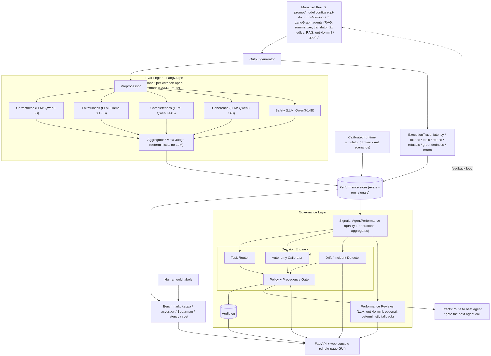
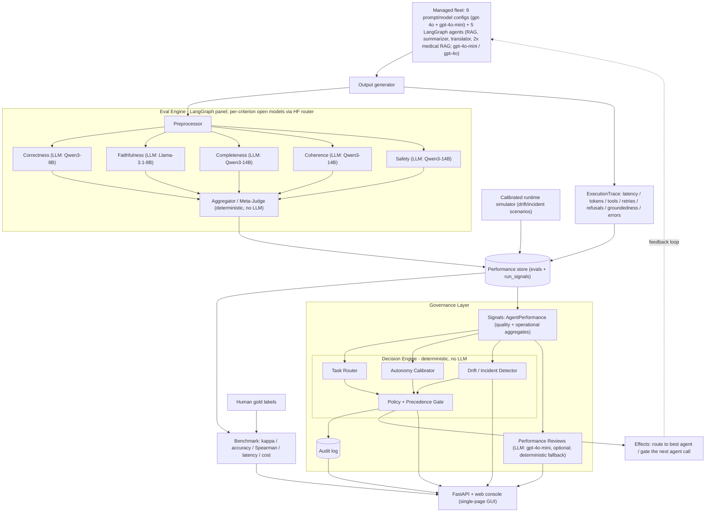

# Final Assignment — Generative AI Systems Design & Implementation

**Project: Agent Workforce Governance**

| | Name | Email |
| --- | --- | --- |
| Student 1 | _<!-- fill in -->_ | _<!-- fill in -->_ |
| Student 2 | _<!-- fill in -->_ | _<!-- fill in -->_ |

This report follows the assignment structure (problem → market research →
architecture → implementation → pitch). The pitch narrative is also in
[pitch.md](pitch.md); the build plan is in [plan.md](plan.md). Full code:
[GaliDev/potential-train](https://github.com/GaliDev/potential-train).

---

## 1. Problem Selection & Definition (5%)

### Chosen Business Problem

Teams increasingly run **fleets of AI agents** (different models, prompts, and
tools) across many tasks, but they manage that fleet *blind*. Existing evaluation
tools produce a quality *score* and stop; they do not answer the operational
questions a platform owner faces daily: **which agent should take the next task,
how much autonomy each agent should have, whether an agent is silently
regressing, and how to enforce oversight with an audit trail.** The result is
wasted spend on over-powered models, quality incidents from the wrong agent on
the wrong task, and no accountable record as automated decisions scale.

### Background & Context

- **Industry / Domain:** AI/ML platform & operations (AgentOps / LLMOps).
- **Current Processes or Systems:** Ad-hoc spreadsheets, one-off eval scripts,
  and gut feel to choose which model/agent to use; autonomy granted by assumption
  rather than evidence; regressions noticed only after they cause an incident.
- **Pain Points:** Wrong agent on the wrong task; over- or under-granted autonomy;
  undetected drift after a model/prompt swap; no compliance-grade audit trail.
- **Business Impact:** Over-spend on premium models for tasks a cheaper agent
  handles; quality incidents that erode user trust; compliance exposure as
  automated decisions scale without an accountable record.

---

## 2. Market Research & Technical Discovery (15%)

### Market Landscape

**Existing Solutions.** The capabilities this platform needs already exist — but
fragmented across four product categories, none of which closes the loop from
*measured quality* into *governed action*:

| Category | Representative tools (2026) | What they do | What they leave open |
| --- | --- | --- | --- |
| Eval / observability | LangSmith, Langfuse, Arize Phoenix, Ragas, OpenAI Evals | Score quality, trace runs, replay against new models | Stop at dashboards — no routing, autonomy, or policy action |
| LLM routers / gateways | OpenRouter, Portkey, LiteLLM, Bifrost | Route requests across models by cost / latency / capability | Route on model price-capability, not measured per-agent, per-task competence |
| AI governance / control | ServiceNow AI Control Tower, Salesforce Einstein Trust Layer | Policy enforcement, PII masking, audit trails | Compliance-centric; autonomy not earned from a validated quality signal |
| Agent workforce mgmt (emerging) | Salesforce Agentforce, Google Agent Inbox | "Manage agents like a team," orchestration, audit | Orchestration / identity centric; no validated competence-based routing |

**Market Gaps.** Each pillar (routing, autonomy, reviews, policy) exists as a
point solution, but **no platform connects them around a validated competence
signal**. Routers route on price; eval tools measure and stop; governance suites
enforce policy. Our wedge is the integration: per-agent, per-task competence from
a judge we have *proven* trustworthy (agreement with human gold labels, Cohen's
kappa ≥ 0.6) drives both *who gets the task* and *how much autonomy* — with an
audit trail — as one accountable system instead of four disconnected ones.

**Target Audience.** Teams operating multiple agents in production who must
control cost, reliability, and governance: platform / ML-ops engineers,
engineering managers, and risk / compliance owners.

### Technical Discovery

**Stakeholder Interviews (discovery insights).** Discovery drew on the authors'
own experience as the target persona (platform/ML-ops engineers) plus informal
discussions with practitioners running multi-agent systems. Recurring themes:
1. *"We pick the model by vibes."* Agent/model choice per task is rarely driven
   by measured per-task quality — teams default to the strongest (expensive) model.
2. *"We find out it regressed from a user complaint."* No automated drift signal
   after a prompt/model swap.
3. *"Autonomy is all-or-nothing."* Either a human reviews everything or nothing;
   no graduated, evidence-based autonomy.
4. *"Audit is an afterthought."* Decisions aren't logged in a way risk teams trust.
   _(Specific interview notes can be appended in the Appendices.)_

**Data Availability & Quality.** Public human-labeled eval data (SummEval for
summarization, WMT for translation) for credibility, plus small hand-labeled gold
sets we control for the demo domains (RAG Q&A, summarization, translation, and a
clinical medical-RAG set). Each gold item carries a human `gold_score` (1–5) and
`gold_pass` label the judge is validated against.

**Feasibility Assessment.** LLM-as-judge is well established; the novel work is
the governance layer and validating the judge against human labels. **Key risk:**
judge reliability — mitigated by measuring agreement with humans and only trusting
the judge once it clears a target (kappa ≥ 0.6). **Cost** is controlled by judging
with cheap open models (HF Inference Providers router) and a cheap-first cascade;
the whole platform runs on a zero-setup SQLite store and a single FastAPI process.

---

## 3. Proposed GenAI System Architecture (20%)

### High-Level Overview

**Solution Concept.** A multiagent **LLM-as-judge** eval engine scores every agent
in the fleet across five criteria, while each agent execution also emits
**operational telemetry** (latency, tokens, tool calls, retries, refusals,
groundedness, errors, safety flags). Both streams are written to a performance
store, and a **governance layer** reads that history to make four decisions —
routing, autonomy calibration, performance reviews, and policy enforcement —
informed by both quality *and* operational reliability.

**Key Functionalities** (technical and business benefit):

- **Multiagent judge panel** (correctness, faithfulness, completeness, coherence,
  safety) with a deterministic aggregator + safety gate. *Tech:* per-criterion
  open models picked by benchmark. *Business:* trustworthy, cheap quality signal.
- **Judge validated against human gold labels** (accuracy, Cohen's kappa,
  Spearman). *Business:* decisions rest on a *proven* signal, not vibes.
- **Real LangGraph runtime agents** (RAG retrieve-check-retry, summarizer
  draft-verify-refine, translator translate-backcheck-retry, and two clinical
  medical-RAG variants) that emit genuine execution traces. *Business:* the demo
  reflects real agent behavior, not mocks.
- **Operational signal capture** per execution (`ExecutionTrace` → `run_signals`):
  uptime, error rate, p95 latency, tool success, retries, refusals, groundedness.
- **Performance-aware router, autonomy tiers, automated reviews, policy engine +
  audit log, and drift/incident alerting.** *Business:* right agent on the right
  task, earned autonomy, fewer incidents, and a compliance-grade trail.
- **Calibrated runtime simulator** that scales telemetry over a time window with
  injectable drift/incident scenarios — governance dynamics are visible without
  large real spend.

### System Architecture Diagram

Data sources (managed fleet, runtime simulator, human gold labels) → preprocessing
(output generator + preprocessor) → GenAI components (LangGraph judge panel,
optional LLM performance reviews) → output delivery (FastAPI web console) and a
**feedback loop** where governance gates/routes the next agent call. LLM-backed
blocks show their model in parentheses; unlabeled blocks are deterministic.



<details>
<summary>Diagram source (Mermaid)</summary>



</details>

### Technology Stack

| Component | Technology Choice | Reason |
| --- | --- | --- |
| Orchestration | LangGraph | Fan-out/join graph for the judge panel; also powers the runtime agents (retrieve/verify/retry loops) |
| Judge LLMs | Per-criterion open models via the HF Inference Providers router (Qwen3-8B / Llama-3.1-8B / Qwen3-14B, see `config/judge_panel.json`); OpenAI `gpt-4o` + `gpt-4o-mini` for forced single-model / cascade modes | Each criterion judged by the model that won it in the `hf_judges` benchmark; open models match gpt-4o agreement at a fraction of the cost |
| Runtime-agent / review LLMs | OpenAI `gpt-4o` + `gpt-4o-mini` (pluggable: HF router or local Ollama) | Strong agent quality; backend-agnostic LLM wrapper so judges/agents can run without OpenAI |
| Data models | Pydantic | Structured LLM outputs and typed DTOs, incl. `ExecutionTrace` telemetry |
| Performance store | SQLite via SQLModel | Zero-setup system of record: `evals` (quality) + `run_signals` (operations) + `audit_log` |
| Metrics | pandas, scipy, scikit-learn | Cohen's kappa, Spearman, precision/recall vs human gold |
| API | FastAPI | Lightweight service surface; also serves the web console |
| Console (GUI) | Static single-page app (HTML/CSS/JS) served by FastAPI | Zero build step, same-origin, demo-friendly UI |

---

## 4. Implementation (50%)

### Scoping the POC

- **Input:** `(task, agent_id, candidate_output, optional context/reference,
  rubric)` for evaluation; and a `(task, context)` for the runtime agents.
- **Output (eval):** per-criterion scores (1–5), pass/fail, aggregate, rationale.
- **Output (operations):** per-execution `ExecutionTrace` (latency, tokens, tool
  calls/failures, retries, refusals, groundedness, errors, safety flags).
- **Output (governance):** routing decision, autonomy tier, performance review,
  drift/incident alerts — with an audit-log entry.
- **Success metric:** agreement of the judge's verdicts with human gold labels.
- **Target:** ≥ 80% pass/fail accuracy and Cohen's kappa ≥ 0.6 (Spearman ≥ 0.7).
- **Minimum viable test set:** hand-labeled RAG, summarization, translation, and
  medical-RAG gold sets (76-item core), plus optional public SummEval / WMT slices.

Per the methodology, we **started with the strongest model and the simplest
prompt** (a single-call gpt-4o baseline judge), proved it against gold, and only
then added the panel, the cascade/jury levers, and the per-criterion open-model
panel.

### Development Steps

1. **Data Preparation** — hand-labeled gold sets in `data/gold/` (incl.
   `medical_rag_gold.jsonl`), plus cached SummEval and WMT loaders
   ([loaders.py](../src/eval_harness/datasets/loaders.py)).
2. **Model Integration** — a backend-agnostic OpenAI-protocol wrapper with
   structured output and per-call cost/latency tracking
   ([llm.py](../src/eval_harness/llm.py)); judges run on the HF Inference
   Providers router, OpenAI, or a local Ollama server.
3. **Application Logic** — LangGraph judge panel + deterministic aggregator
   ([graph.py](../src/eval_harness/graph.py)); the governance decision engine
   ([governance/](../src/eval_harness/governance)); real runtime agents wired
   through a pluggable registry ([registry.py](../src/eval_harness/fleet/registry.py)).
4. **Testing & Validation** — benchmark vs human gold
   ([benchmark.py](../evaluation/benchmark.py)); baseline vs panel vs cascade vs
   jury; per-candidate-model benchmark ([hf_judges/](../hf_judges)); 112 offline
   unit tests covering telemetry, the simulator, runtime agents, and governance.

### Challenges & Solutions

- **Challenge:** Trusting the judge enough to drive real decisions.
  **Solution:** benchmark every judge configuration against human gold labels and
  gate on agreement (kappa ≥ 0.6) before its scores feed governance.
- **Challenge:** LLM-judge cost at fleet scale.
  **Solution:** a cheap-first **cascade** (gpt-4o-mini screens, escalates only
  borderline items) and a **per-criterion open-model panel** that matches gpt-4o
  agreement at ~1/57th the cost.
- **Challenge:** Cloud credit exhaustion mid-build (OpenAI quota + HF credits).
  **Solution:** the LLM wrapper is backend-agnostic — agents and judges were run
  against a **local Ollama Llama-3.1** with no code changes, then back on the
  cloud models once restored.
- **What if a KPI missed target?** The fleet-wide **operational** KPIs (uptime,
  error rate, p95 latency) intentionally fall short of the naive targets because
  the demo fleet *deliberately* contains weak agents and the simulator *injects*
  drift/incidents (a `rag_weak` safety incident, a `sum_weak` latency spike).
  That is the system's reason to exist: governance **detects and gates** them —
  blocking 3 low-autonomy agents lifts served-answer quality from 65% to 92%. We
  document the raw fleet numbers honestly rather than hiding the weak agents.

### System Performance — Technical KPIs

| Metric | Description | Target | Achieved |
| --- | --- | --- | --- |
| Accuracy | Judge pass/fail verdicts agreeing with human gold labels (panel) | ≥ 90% | **98.7%** ✅ |
| Latency | Avg agent-execution wall-clock per item (p95) | < 2 s | **2.76 s** ⚠️ |
| Uptime | Successful agent executions / total (`run_signals.success`) | ≥ 99% | **93%** ⚠️ |
| Error rate | Failed agent executions / total | < 5% | **7%** ⚠️ |

⚠️ The latency/uptime/error numbers are **fleet-wide and include the deliberately
weak agents and injected incidents** — the governance layer's job is to catch
them. Supporting detail:

- **Judge agreement with human gold (the validated core metric):** accuracy
  **98.7%**, Cohen's kappa **0.97**, Spearman **0.97** — all clear the assignment
  targets (≥80% / ≥0.6 / ≥0.7). The per-criterion open-model panel holds this
  agreement at **~$0.00014/item (~57× cheaper than the gpt-4o panel)**.
- **Tool success rate:** **95%** (target ≥ 90%) ✅.
- **Fleet output quality (per-criterion avg, 1–5):** correctness 4.10,
  faithfulness 4.10, completeness 3.90, coherence 4.15, safety 4.76.

### System Performance — Business KPIs

_Measured via the platform's KPI report ([kpi_report.py](../evaluation/kpi_report.py)).
Assumptions: human review 4 min/item @ $40/hr; routing savings use blended model
list prices._

| Metric | Description | Baseline | After Implementation | Improvement |
| --- | --- | --- | --- | --- |
| Cost Reduction | Route to cheapest-good-enough agent vs always-strong (blended $/1M index) | 6.25 | 0.38 | **−94%** |
| Productivity Gain | Evaluations processed per hour (system vs human reviewer) | 15 / hr | 248 / hr | **≈17× (+1,553%)** |
| Customer Satisfaction | Served-answer quality proxy = fleet pass rate after gating low-autonomy agents | 3.25 / 5 (65%) | 4.60 / 5 (92%) | **+1.35 / 5 (+27 pts)** |
| Revenue Impact | Additional revenue attributable to the platform | — | — | **Projected** (out of POC scope) |

### Business Impact Highlights

- **Operational Efficiency:** ~17× evaluation throughput vs human review — about
  **22 review-hours saved per 356-item batch**, freeing staff for high-value work.
- **Cost Savings:** ~**$892 labeling cost saved per batch**, plus **~94% lower
  fleet inference cost** by routing tasks to the cheapest agent that still passes.
- **Customer Retention:** gating low-autonomy agents lifts served quality from
  **65% → 92%**, so fewer poor answers reach users — improving trust and reducing
  churn risk.
- **Market Advantage:** closes the loop the four incumbent categories leave open —
  validated competence → routing + earned autonomy + audit — positioning the team
  as an early mover in the forming "agent workforce management" category.

### Strategic Scalability Potential

- **New task families plug in** via the agent registry + a gold set — the clinical
  medical-RAG agents were added with **no changes to the core engine**.
- **Backend-agnostic LLM layer** (OpenAI / HF router / local Ollama) — swap judges
  or agents, or run fully offline, without code changes.
- **Storage behind a Protocol** — SQLite can be swapped for a managed store for
  multi-tenant scale.
- **Predictive governance** — as real history accumulates, drift detection enables
  proactive demotion/alerting rather than reactive incident response.

### Screenshots / Code Snippets

The static web console (`app/web/index.html`, served at `http://localhost:8000`)
surfaces the platform end to end:

- **Fleet leaderboard** — each agent's autonomy tier, verdict, confidence, trend.
- **Decision spotlight** — the precedence chain (safety → drift → autonomy →
  policy), per-criterion scorecard, and rationale for one agent.
- **Operations** — uptime, error rate, p95 latency, tool success, drift alerts.
- **Audit log** — chronological governance decisions.

_(Attach console screenshots and a sample `/decisions` API response here.)_

### Code Repository

Full code: **[GaliDev/potential-train](https://github.com/GaliDev/potential-train)**.
Quick start in [README.md](../README.md); how to run is reproduced below.

```bash
python -m venv .venv && source .venv/bin/activate
pip install -r requirements.txt
cp .env.example .env   # HF_TOKEN (default panel) + OPENAI_API_KEY (forced/cascade)

# Benchmark the judge vs gold labels
PYTHONPATH=src python -m evaluation.benchmark --mode compare --with-improve
# Generate operational history with drift/incident scenarios (offline)
PYTHONPATH=src python -m eval_harness.simulate_runtime
# Run the real LangGraph runtime agents over gold tasks
PYTHONPATH=src python -m evaluation.fleet_run --limit-per-type 1
# Technical + Business + operational KPI report
PYTHONPATH=src python -m evaluation.kpi_report
# GUI + API: web console at http://localhost:8000 (offline via "⋯ → Seed data")
PYTHONPATH=src uvicorn app.api:app --reload
```

---

## 5. Pitch to Class (10%)

- **Hook:** "Your AI fleet is a team with no manager — you'd never let a new hire
  run unsupervised on day one, yet that's how most agents ship."
- **Problem:** Teams run fleets of agents blind — picking models by vibes, finding
  out about regressions from user complaints, and granting autonomy by assumption.
- **Solution Overview:** A platform that scores every agent with a *validated*
  LLM-judge and turns that history into four governed decisions — routing, earned
  autonomy, performance reviews, and policy enforcement with an audit trail.
- **Demo:** seed/simulate → fleet leaderboard → Operations (uptime, error, p95,
  drift alerts) → autonomy tiers → route a task to the best agent → generate a
  performance review → policy gate + audit log → the medical-RAG `weak` vs
  `strong` agents earning different autonomy tiers.
- **Business Value:** ~94% lower inference cost via routing, ~17× faster than human
  review, and served quality 65% → 92% by gating weak agents — competence you can
  *prove*, governance you can *audit*.
- **Call to Action:** Point it at your own Langfuse traces, validate the judge on
  your gold set, and let earned autonomy replace all-or-nothing review.

---

## Appendices

- **Full code:** [GaliDev/potential-train](https://github.com/GaliDev/potential-train)
- Pitch narrative: [pitch.md](pitch.md) · Build plan: [plan.md](plan.md) ·
  Milestone 1 record: [milestone-01-foundation.md](milestone-01-foundation.md)
- _Stakeholder interview notes and console screenshots can be attached here._

### Appendix A — Judge configuration comparison (76-item gold set)

We started with a single-call gpt-4o baseline, then measured the panel and the
cost/quality levers against the same human gold labels. (The `Panel` column was
measured on the earlier all-gpt-4o panel and is kept as the methodology baseline;
the *shipped* panel uses per-criterion open models — see Appendix B.)

| Metric | Target | Baseline | Panel (gpt-4o) | Cascade | Jury |
| --- | --- | --- | --- | --- | --- |
| Pass/fail accuracy vs human | ≥ 80% | 100% | 98.7% | 100% | 98.7% |
| Cohen's kappa | ≥ 0.6 | 1.00 | 0.97 | 1.00 | 0.97 |
| Spearman (score vs human) | ≥ 0.7 | 0.98 | 0.98 | 0.95 | 0.97 |
| Score MAE vs human (1–5) | lower | 0.24 | 0.26 | 0.32 | 0.27 |
| Avg latency / item | < 2 s (baseline) | 1.6 s | 10.6 s | 9.7 s | 35.7 s |
| Cost / item | lower | $0.0013 | $0.0080 | $0.0010 | $0.0240 |

All four configurations clear the agreement targets. The **cascade** is the best
cost lever (perfect pass/fail agreement at less than the baseline's cost); the
**jury** is the quality/redundancy lever (slower, costlier).

### Appendix B — Shipped panel: per-criterion open models (HF router)

The deployed panel assigns each criterion to the open model that won it in the
`hf_judges` benchmark (latest run 2026-06-11, same 76-item gold set):

| Criterion | Judge model | Pass-acc | Kappa | Spearman | MAE |
| --- | --- | --- | --- | --- | --- |
| Correctness | Qwen3-8B | 0.974 | 0.947 | 0.951 | 0.237 |
| Faithfulness | Llama-3.1-8B | 0.974 | 0.947 | 0.950 | 0.342 |
| Completeness | Qwen3-14B | 1.000 | 1.000 | 0.965 | 0.276 |
| Coherence | Qwen3-14B | 1.000 | 1.000 | 0.973 | 0.184 |
| Safety | Qwen3-14B | 0.934 | 0.868 | 0.956 | 0.237 |

The open-model panel holds the same agreement band as the gpt-4o panel while
costing **~$0.00014 / item (~57× cheaper than gpt-4o's $0.0080)** — same judge
quality, ~98% lower cost.
